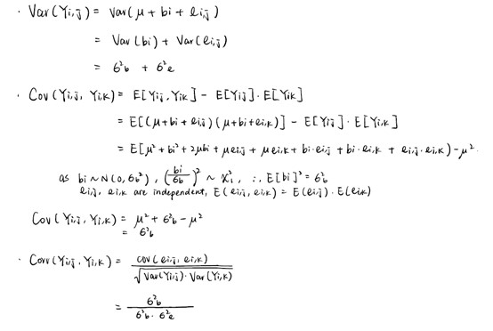
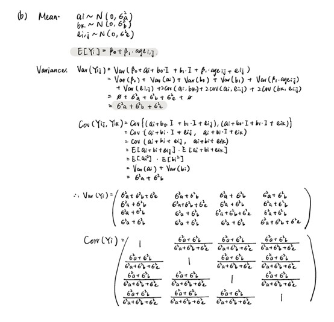

```{r include=FALSE}
library(tidyverse)
library(nlme)
setwd("C:/Users/irene/OneDrive - cumc.columbia.edu/2021 M1 Spring/Biostatistical Methods 2/HW/HW6")
```

## Question 1

(Just in case the image cannot show properly, I also attached a jpg file of question 1 in submission. )



\newpage

## Question 2

A study was conducted involving 27 children, 16 boys and 11 girls. On each child, the distance (mm) from the center of the pituitary to the pterygomaxillary fissure was made at ages 8, 10, 12, and 14. The goal was to study how distance is affected by age and gender. The data file has 5 columns: (1) observation number, (2) child number (1-27), (3) age, (4) distance measurement, and (5) indicator of gender (0 =girl, 1 =boy).

```{r message=FALSE, warning=FALSE}
dental.df = read.csv("./HW6-dental.txt", sep = "") %>%
  janitor::clean_names() %>%
  mutate(gender = as.factor(gender),
         gender = recode(gender, "0" = "Female", "1" = "Male")) %>%
  dplyr::select(-index)
```

#### (a) Make a spaghetti plot to infer how distance is affected by age and gender.

```{r, fig.align = 'center'}
ggplot(dental.df, aes(x = age, y = distance, col = gender, group = child)) + 
  geom_line()
```

\newpage

#### (b) 

(Just in case the image cannot show properly, I also attached a jpg file of question 2-b in submission. )



\newpage

#### (c) Fit a model with (a) compound symmetry covariance, (b) exponential covariance, (c) autoregressive covariance. Compare the coefficient parameter estimates and the covariance estimates.

1. Compound symmetry covariance: 

```{r}
comsym <- gls(distance ~ age + gender, dental.df, correlation = corCompSymm(form = ~ 1| child), method = "REML")
summary(comsym)
corMatrix(comsym$modelStruct$corStruct)[[1]]
```

\newpage

2. exponential covariance: 

```{r}
exp.fit <- gls(distance ~ age + gender, dental.df, correlation = corExp(form = ~ 1 |child), method = "REML")
summary(exp.fit)
```

\newpage

3. Autoregressive covariance:

```{r}
auto1 <- gls(distance ~ age + gender, dental.df, correlation=corAR1(form = ~ 1 |child), method = "REML")
summary(auto1)
corMatrix(auto1$modelStruct$corStruct)[[1]]
```

\newpage

**Compare coefficient parameter estimates:**
```{r}
coeff = rbind(comsym$coefficients, exp.fit$coefficients, auto1$coefficients)
rownames(coeff) = c("Comp Symmetry", "Exponential", "Autoregressive")
coeff %>%
  knitr::kable()
```

According to the table above, the three methods give similar coefficient parameters. 

<br>
<br>

**Compare covariance estimates:**
```{r}
getVarCov(comsym)
getVarCov(exp.fit)
getVarCov(auto1)
```

According to the tables above, the exponential and autoregressive method have similar covariance matrices. 