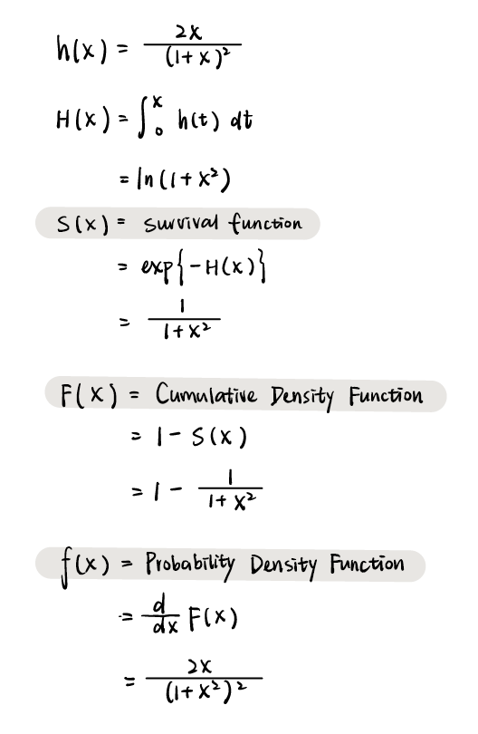
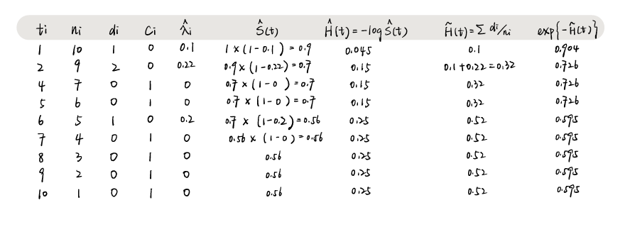

```{r message=FALSE, warning=FALSE, include=FALSE}
library(tidyverse)
library(KMsurv)
library(survival)
setwd("C:/Users/irene/OneDrive - cumc.columbia.edu/2021 M1 Spring/Biostatistical Methods 2/HW/HW9")
```

# Problem 1

```{r, out.height = "400px"}

```


\newpage

# Problem 2

```{r, fig.align = 'center'}

```


\newpage


# Problem 3

Use the tongue data in the R package KMsurv. For each tumor type (aneuploidy and diploid), plot the Kaplan-Meier curve of survival function and its pointwise 95% confidence intervals (using the log transformation). What are the estimated 1-year
survival rate and 95% CI?

```{r}
data("tongue")
tongue = tongue %>%
  as_tibble() %>%
  mutate(type = if_else(type == 1, "aneu", "di"))
```


## Aneuploid Plot
```{r, fig.align = 'center'}
aneu.km = survfit(Surv(time, delta) ~ 1, 
                    data = subset(tongue, 
                                  type == "aneu"),
                    conf.type = "log")
aneu.plot = plot(aneu.km,
                 conf.int = TRUE,
                 mark.time = TRUE,
                 xlab = "Time",
                 ylab = "Survival Prob",
                 main = "KM Plot of Aneuploid Type Tumor",
                 cex.lab = 1.5,
                 cex.main = 1.5)
```

\newpage

## Diploid Plot
```{r, fig.align = 'center'}
di.km = survfit(Surv(time, delta) ~ 1, 
                    data = subset(tongue, 
                                  type == "di"),
                    conf.type = "log")
di.plot = plot(di.km,
               conf.int = TRUE,
               mark.time = TRUE,
               xlab = "Time",
               ylab = "Survival Prob",
               main = "KM Plot of Diploid Type Tumor",
               cex.lab = 1.5,
               cex.main = 1.5)
```

\newpage

## Prediction

```{r}
tongue.km = survfit(Surv(time, delta) ~ type,
                    data = tongue)
tongue.summ = summary(tongue.km, time = 365/7)

ci = t(rbind(tongue.summ$surv, tongue.summ$lower, tongue.summ$upper))
rownames(ci) = c("aneuploid", "diploid")
colnames(ci) = c("estimate", "lower", "upper")
ci %>%
  knitr::kable()
```